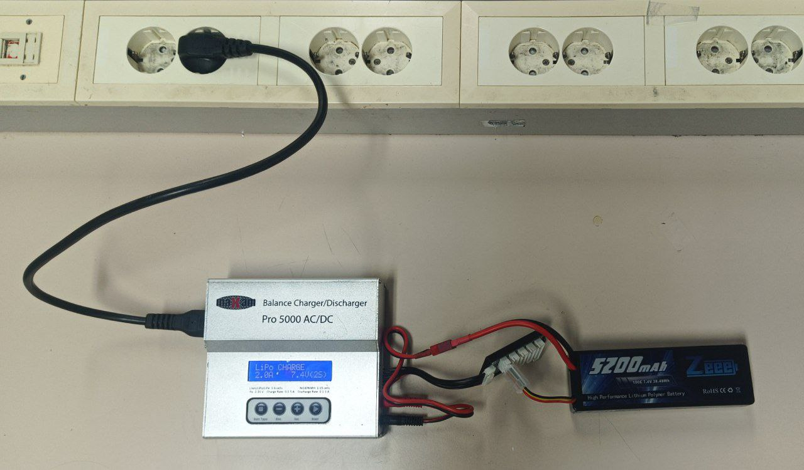
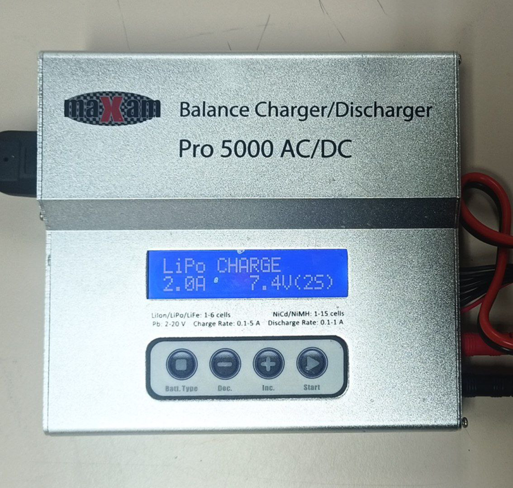
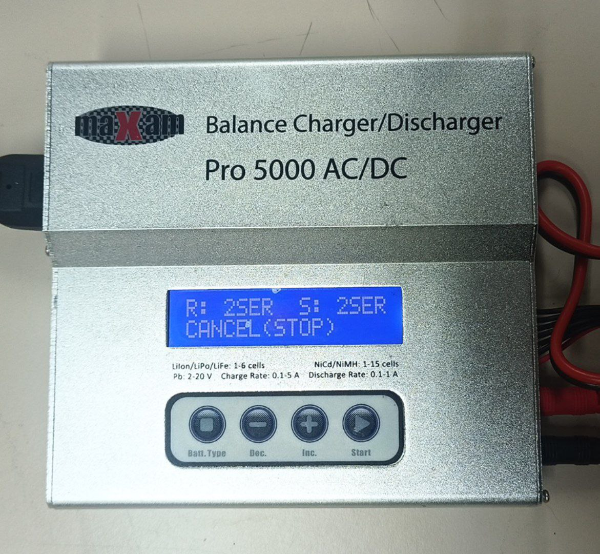
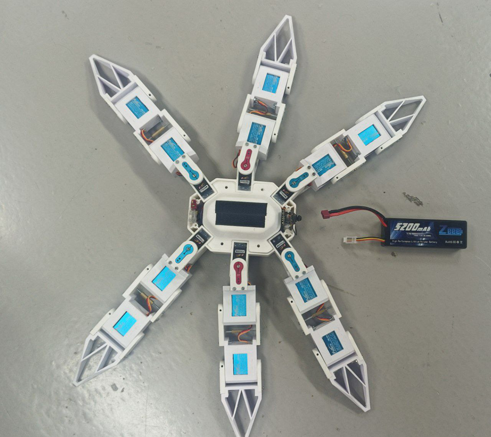
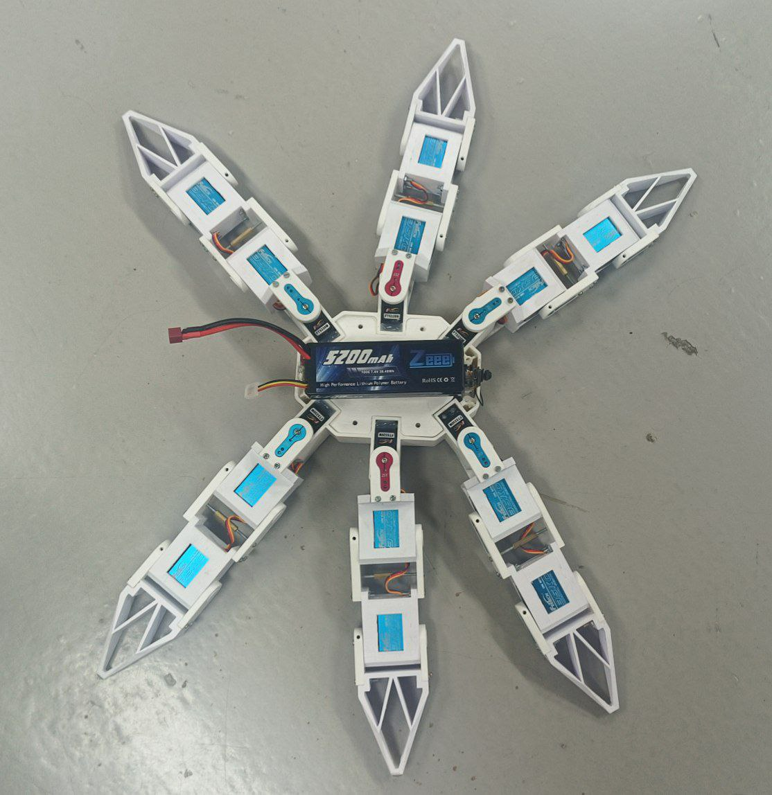
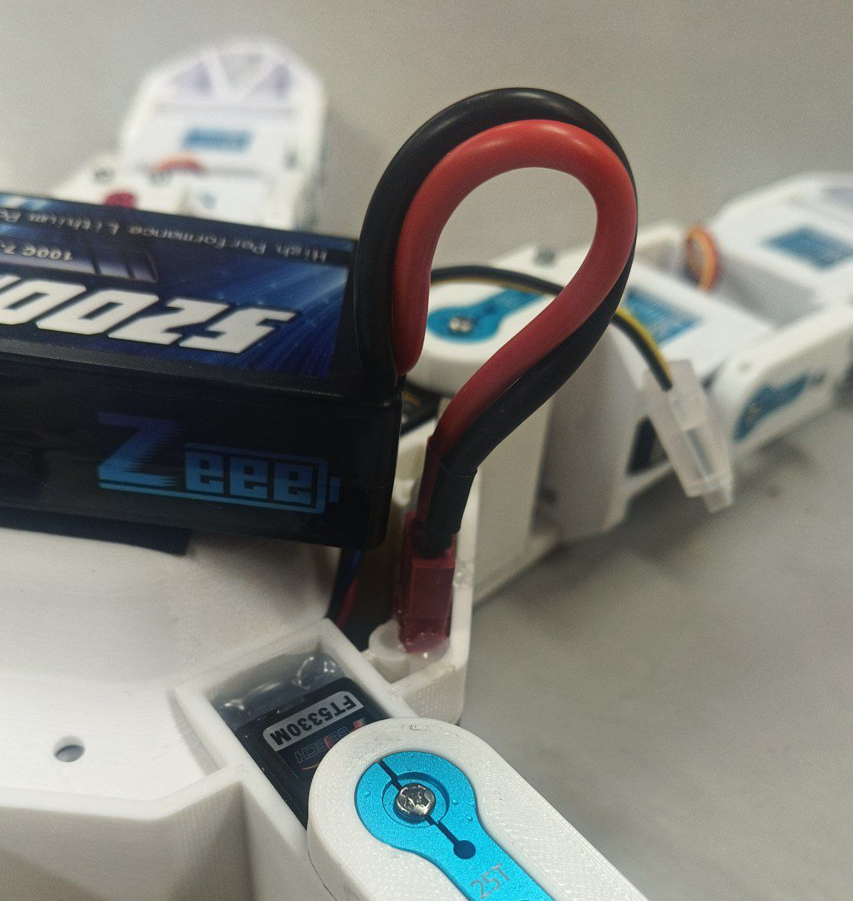
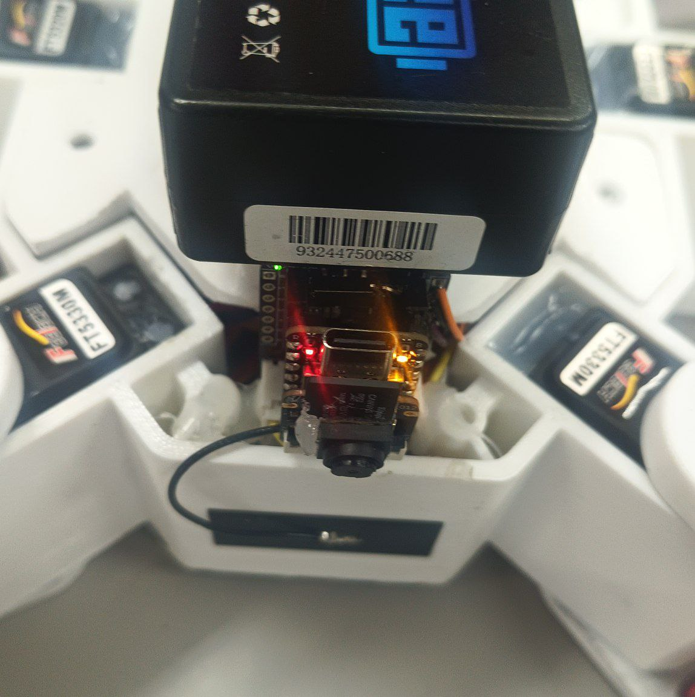
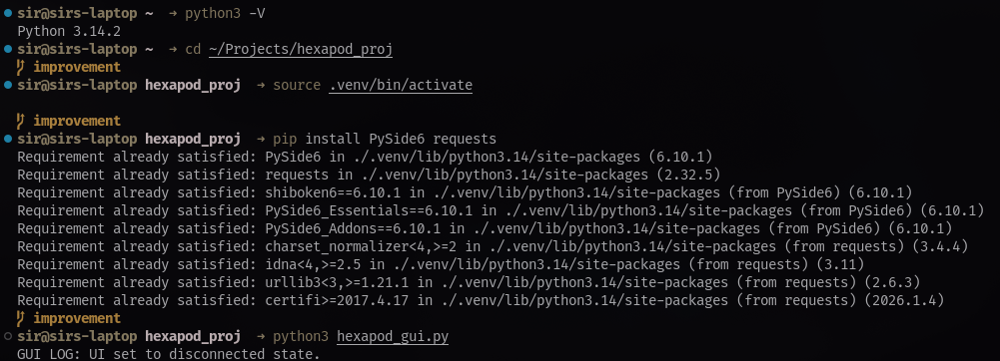
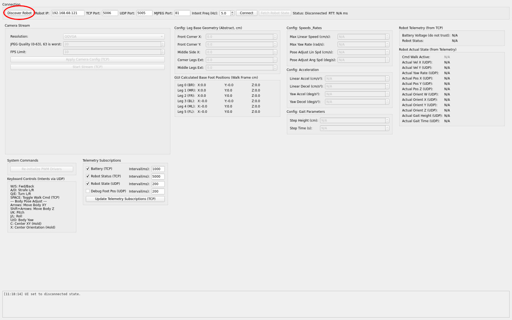

# Quickest Start Guide by YourDire™

*Brought to you by a humble student that wants to make sure that those who interact with the project after him can do so without any problems*

## Starting the robot

### Making sure the battery is charged

The safest way to make sure the battery is charged is by connecting it to a charging station, starting to charge it, and looking at the reported voltage. *Make sure to check the battery for any signs of damage before you start charging/using it. If a battery begins to warm up, smoke, or catches fire, your best bet is shoving it into a fireproof container, carrying it outside and letting it burn down. Electrical fires should not be exringuished using water.* 

*This is how a correctly connected charging station looks. Connect the thick main wires to an adapter that connects to the charging station, and the three colored wires to the smallest notch in the extender that is connected to the charging station.*

*This is how the main menu of the charging station looks. Press the "Start" button to cycle between mode, current and voltage, which can be adjusted with the "Dec." and "Inc." buttons. Make sure to select the "CHARGE" mode, current of 2.0A, voltage of 7.4V, and the LiPo battery type. You can change the current battery type by pressing the "Batt. Type" button repeatedly, and pressing the "Start" button once to confirm.*

*After you selected the correct options, hold down the "Start" button to begin charging the battery. After performing a battery check, the charging station will ask for confirmation. Press "Start" again after double-checking the connections. If the battery check fails, make sure you connected the battery correctly. If you're 100% sure the battery is connected correctly, and you selected the correct battery type, your battery might be damaged.*

*This is how the charging menu looks. Your battery is safe to use if the voltage shown in the upper-right corner of the display is above 7.7V. Otherwise, leave the battery charging for a while. Most errors that you might encounter are not serious - just double-check whether you connected everything correctly.*

### Powering up the robot

After making sure that your battery is charged, simply attached it to the top of the Hexapod, and connect the red and black wires from the battery to the connector on the hexapod. The connector is not symetrical - you can only connect the battery correctly. Below are pictures of how a correctly connected battery looks on the Hexapod.

*Make sure the Hexapod has enough free space*

*You should be able to access both the USB type-C connector and battery connector at the same time after attaching the battery*

*Here's how a correctly attached battery looks - don't worry about the cables too much*

*The green LED is the power indicator - if it's on, the Hexapod is receiving power*

## Connecting to the robot

### Running the GUI

This is the hardest part - for details on how to do this refer to the other guides, but here I'll cover only the most essential knowledge.

First, obtain the project files, and navigate to their location in the terminal using the `cd` command. Make sure you have python 3 installed by running `python3 -V` or `python -V`. If the commands are not found, install python from python.org.

Run `python -m venv .venv`, (or python3) followed by `.venv\Scripts\activate` on windows, or `source .venv/bin/activate` on MacOS/Linux. After that, run `pip install PySide6 requests`. Usually pip comes installed with python. After you have installed the dependecies using the above command run `python hexapod_gui.py`.

*How the GUI is run on a machine running Arch Linux with python installed and the virtual environment already created*

### Connecting

To connect wirelessly, make sure that the yellow LED on the hexapod is ON and *not* blinking (See the last picture in the charpter ["Powering up the robot"](#powering-up-the-robot) above; If the yellow LED is blinking, the Hexapod is actively trying to connect to WiFi. If it is off, it is in offline mode - reboot it by re-connecting the battery.) For the Hexapod to automatically connect to WiFi, there must be a network called "raspberrypi" nearby, and it must have the password "elevprojekt". I recommend using an old router for this, as mobile hotspots will most likely *not* work. Consult the other guides for alternatives.

Once your device and the robot are on the same network, press the "Discover Robot" button in the GUI:

After it is discovered, press the "Connect" button:

*In the terminal you can verify the details that were entered to the left of the "Connect" button*

Once the connection is established, press spacebar on your keyboard to start walking using it.

*Make sure the status is "Connected & Synced", and that Cmd Walk is "ACTIVE"*

**Congratulations!** The Hexapod is up and running! Consult the controls in the bottom left of the GUI to steer it. When you are done, simply close the GUI and power down the robot by disconnecting its battery. Repeat the above instructions (except installing the packages and downloading files, just activate the virtual environment) to re-connect to the Hexapod at a later date.